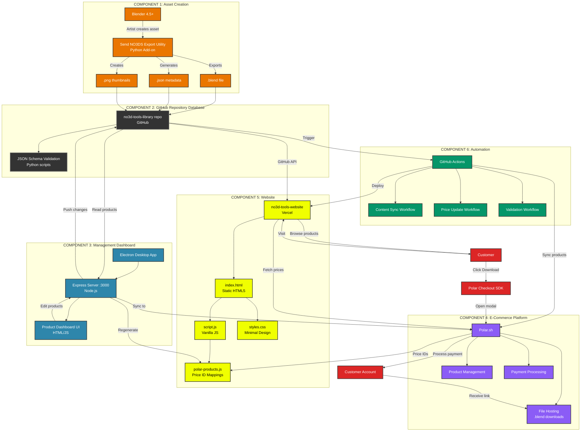

# SOLVET Global - Multi-Repository Digital Asset Publishing System

**SOLVET** (Solve Et Coagula) is an end-to-end workflow system for publishing Blender digital assets from creation to e-commerce. The system coordinates multiple repositories to automate the complete publishing pipeline.

## 🎯 System Overview

SOLVET Global is a multi-repository workspace that manages the complete lifecycle of digital assets:

1. **Asset Creation** - Blender add-on exports assets with metadata
2. **Asset Storage** - GitHub repository serves as the database
3. **E-commerce Website** - Static site displays products and handles checkout
4. **Payment Processing** - Polar.sh integration for payments and file hosting
5. **Automation** - GitHub Actions syncs data across all components

## 🏗️ Architecture



## 📦 Repository Structure

SOLVET Global coordinates multiple repositories:

### Core Repositories

- **`no3d-tools-library/`** - Asset database (GitHub: `node-dojo/no3d-tools-library`)
  - Product folders with `.blend`, `.json`, icons, and metadata
  - Serves as the single source of truth for all products
  - Accessed via GitHub API by website and other tools

- **`no3d-tools-website/`** - E-commerce website (GitHub: `node-dojo/no3d-tools-website`)
  - Static HTML/CSS/JS site deployed on Vercel
  - Fetches products from `no3d-tools-library` via GitHub API
  - Integrates Polar.sh checkout SDK
  - Live at: https://no3dtools.com

- **`no3d-tools-addon/`** - Blender add-on (GitHub: `node-dojo/no3d-tools-addon`)
  - Python add-on for Blender 4.5+
  - Exports assets with metadata to repository structure
  - Generates JSON, thumbnails, and organized folders

- **`solvet-system/`** - Shared resources (GitHub: `node-dojo/solvet-system`)
  - JSON schemas for product metadata validation
  - Templates and scripts
  - Documentation and architecture guides

### Additional Libraries

- **`no3d-not3s-library/`** - Educational content library
- **`no3d-prints-library/`** - 3D print assets library
- **`solvet-cli/`** - Command-line interface for SOLVET operations

## 🔄 Workflow

### 1. Asset Creation & Export

**Blender Add-on** (`no3d-tools-addon/`)
- Artist creates asset in Blender 4.5+
- Uses "Send NO3DS Export Utility" add-on
- Exports to `no3d-tools-library/` repository:
  - `.blend` file (main asset)
  - `.json` metadata (validated against schema)
  - `icon_{ProductName}.png` (thumbnail)
  - Optional: description markdown, video previews

### 2. Repository Storage

**GitHub Repository** (`no3d-tools-library/`)
- Each product in its own folder
- Structure:
  ```
  Product Name/
  ├── Product Name.blend
  ├── Product Name.json
  ├── icon_Product Name.png
  ├── Product Name_desc.md (optional)
  └── Product Name.mp4 (optional)
  ```
- Automated validation ensures schema compliance
- GitHub serves as the database (Git as version control)

### 3. Website Display

**E-commerce Website** (`no3d-tools-website/`)
- Fetches products from `no3d-tools-library` via GitHub API
- Displays products in three-column layout:
  - Sidebar navigation (140px)
  - Product details (870px)
  - Icon grid (191px)
- Integrates Polar.sh checkout for purchases
- Deployed on Vercel with automatic updates

### 4. E-commerce Integration

**Polar.sh** (External Service)
- Payment processing
- Secure file hosting for `.blend` downloads
- Customer account management
- Product synchronization via API

### 5. Automation

**GitHub Actions**
- Content sync workflow: Updates website when repository changes
- Price update workflow: Syncs prices from Polar to website
- Validation workflow: Ensures product integrity
- Bundle generation: Creates product bundles based on metadata tags

## 🚀 Quick Start

### Prerequisites

- Node.js 20+
- Python 3.8+
- Blender 4.5+ (for add-on)
- Git
- GitHub account
- Vercel account (for website deployment)
- Polar.sh account (for e-commerce)

### Setup

1. **Clone the workspace:**
   ```bash
   git clone https://github.com/node-dojo/no3d-tools-library.git
   ```

2. **Update all repositories:**
   ```bash
   ./update-all.sh
   ```

3. **Check status:**
   ```bash
   ./status-all.sh
   ```

4. **Open workspace in Cursor:**
   ```bash
   cursor .vscode/solvet.code-workspace
   ```

### Daily Workflow

```bash
# Pull latest changes from all repos
./update-all.sh

# Check status of all repositories
./status-all.sh

# Work in specific repository
cd no3d-tools-website
# Make changes, commit, push...
```

## 📁 Key Directories

```
SOLVET GLOBAL/
├── no3d-tools-library/          # Asset database (GitHub repo)
│   └── Dojo*/                   # Product folders
├── no3d-tools-website/          # E-commerce site (GitHub repo)
│   ├── index.html               # Main page
│   ├── script.js                 # Product loading logic
│   ├── styles.css               # Design system styles
│   └── api/                     # Serverless API functions
├── no3d-tools-addon/            # Blender add-on (GitHub repo)
│   ├── __init__.py              # Add-on entry point
│   ├── operators.py             # Export operators
│   └── utils.py                 # Utility functions
├── solvet-system/               # Shared resources (GitHub repo)
│   ├── schemas/                 # JSON validation schemas
│   ├── templates/               # Product templates
│   └── scripts/                 # Validation scripts
├── scripts/                     # Workspace utility scripts
│   ├── update-all.sh            # Update all repos
│   └── status-all.sh            # Check all repo status
└── plan docs/                   # Architecture documentation
```

## 🎨 Design System

### Colors
- **Lello**: `#f0ff00` (primary accent)
- **Deep Charcoal**: `#1A1A1A` (primary text)
- **Stone Gray**: `#E8E8E8` (background)
- **Dark Gray**: `#222222` (secondary text)

### Typography
- **Headers**: Visitor font family
- **Body**: Silka Mono font family
- **Size Scale**: 37.5px → 19px → 15px → 11px → 9px → 8px

### Layout
- Three-column grid: 140px | 870px | 191px
- 10px base unit spacing system
- Minimal black/white aesthetic with Lello accents

## 🔧 Tools & Scripts

### Workspace Scripts

- **`update-all.sh`** - Pull latest changes from all repositories
- **`status-all.sh`** - Check git status of all repositories

### SOLVET CLI

```bash
cd solvet-cli
npm install
npm link
solvet --help
```

### Validation

```bash
# Validate products in library
python scripts/validate-products.py

# Validate against schema
python solvet-system/scripts/validate-products.py /path/to/product
```

## 📚 Documentation

- **[QUICK_START.md](QUICK_START.md)** - Getting started guide
- **[plan docs/MULTI_REPO_ARCHITECTURE.md](plan docs/MULTI_REPO_ARCHITECTURE.md)** - Architecture details
- **[plan docs/SOLVET system PRD.md](plan docs/SOLVET system PRD.md)** - Product requirements
- **[plan docs/REPOSITORY_STRUCTURE.md](plan docs/REPOSITORY_STRUCTURE.md)** - Repository organization
- **[solvet-stack-diagram.md](solvet-stack-diagram.md)** - System architecture diagram
- **[no3d-tools-website/VERCEL_DEPLOYMENT_SETUP.md](no3d-tools-website/VERCEL_DEPLOYMENT_SETUP.md)** - Deployment guide

## 🔗 Integration Points

### GitHub API
- Website reads products from `no3d-tools-library` repository
- Rate limit: 5,000 requests/hour (authenticated)
- Uses raw.githubusercontent.com for file access

### Polar.sh API
- Product synchronization
- Price management
- Checkout integration
- File hosting for downloads

### Vercel
- Website deployment
- Serverless API functions
- Automatic deployments on git push

## 🎯 Key Features

- ✅ **Automated Workflow** - From Blender export to live website
- ✅ **Multi-Repository Architecture** - Independent, scalable components
- ✅ **GitHub as Database** - Version-controlled asset storage
- ✅ **Schema Validation** - Ensures data consistency
- ✅ **Polar Integration** - Payment processing and file hosting
- ✅ **Design System Compliance** - Consistent UI/UX
- ✅ **Automated Sync** - GitHub Actions coordinate updates

## 🚧 Development Status

### Completed
- ✅ Blender add-on export functionality
- ✅ GitHub repository structure
- ✅ Metadata schema definition
- ✅ Website layout and design
- ✅ GitHub API integration
- ✅ Polar.sh checkout integration
- ✅ Basic automation workflows

### In Progress
- 🚧 Enhanced automation workflows
- 🚧 Bundle generation system
- 🚧 Management dashboard
- 🚧 Advanced validation rules

### Planned
- ⏳ Real-time sync improvements
- ⏳ Advanced search and filtering
- ⏳ Customer account features
- ⏳ Analytics integration

## 🤝 Contributing

See individual repository READMEs for contribution guidelines:
- [no3d-tools-library/README.md](no3d-tools-library/README.md)
- [no3d-tools-website/README.md](no3d-tools-website/README.md)
- [no3d-tools-addon/README.md](no3d-tools-addon/README.md)

## 📄 License

Part of the SOLVET System ecosystem. See individual repositories for specific licenses.

## 🔗 Links

- **Website**: https://no3dtools.com
- **Asset Library**: https://github.com/node-dojo/no3d-tools-library
- **Website Repo**: https://github.com/node-dojo/no3d-tools-website
- **Add-on Repo**: https://github.com/node-dojo/no3d-tools-addon
- **System Repo**: https://github.com/node-dojo/solvet-system

---

**SOLVET Global** - Solve Et Coagula: Breaking down and rebuilding the digital asset publishing workflow.
