# SOLVET Global - Multi-Repository Digital Asset Publishing System

[](https://opensource.org/licenses/MIT)
[](https://nodejs.org/)
[](SECURITY.md)

**SOLVET** (Solve Et Coagula) is an end-to-end workflow system for publishing Blender digital assets from creation to e-commerce. The system coordinates multiple repositories to automate the complete publishing pipeline.

## 🎯 System Overview

SOLVET Global is a multi-repository workspace that manages the complete lifecycle of digital assets:

### 🚀 Full Digital Asset Life Cycle: Management, Publishing & E-Commerce

1. **Asset Creation** – Blender add-on exports assets with metadata  
2. **Asset Management** – Local CO-AUG dashboard for editing, validation, and structuring  
3. **Asset Storage** – GitHub repositories serve as versioned asset libraries  
4. **Automated Asset Publishing** – GitHub Actions sync and deploy assets to the website  
5. **Asset Selling & Delivery** – Website e-commerce framework handles product listing, checkout, access, and delivery  

## 🏗️ Architecture



```mermaid
graph LR
    subgraph "1. Asset Creation"
        A[Blender 4.5+<br/>Asset Creation]
        B[SOLVET Asset Management Add-on<br/>Internal Export Tool]
        I1[Local Folders<br/>& Files]
        I2[Other Sources...]
    end
    
    subgraph "2. Asset Management"
        D[CO-AUG Dashboard<br/>Asset Editing & Creation]
        C[Product Structure<br/>& Metadata]
    end
    
    subgraph "3. Storage"
        E1[no3d-tools-library<br/>Blender Asset Library]
        E2[no3d-prints-library<br/>3D Printable Files]
        E3[no3d-notes-library<br/>Educational Content<br/>Project Documentation]
        E4[no3d-cod3-library<br/>Vibe Coding Projects]
    end
    
    subgraph "4. Automated Asset Publishing"
        F{Automated Publishing<br/>via GitHub Actions}
        G((Website<br/>Patreon<br/>Gumroad<br/>Shopify))
    end
    
    subgraph "5. Asset Selling & Delivery"
        O1[Blender Assets]
        O2[3D Printable Files]
        O3[Educational Content]
        O4[Coding Projects]
        H((Happy no3d member))
    end

    A -->|Creates Assets| B
    B -->|Exports| D
    I1 -->|Imports| D
    I2 -->|Imports| D
    D -->|Validates, Structures,<br/>Manages & Edits| C
    C -->|Stored in| E1
    C -->|Stored in| E2
    C -->|Stored in| E3
    C -->|Stored in| E4
    E1 --> F
    E2 --> F
    E3 --> F
    E4 --> F
    F --> G
    G -->|Polar| O1
    G -->|Thangs? tbd| O2
    G -->|tbd| O3
    G -->|tbd| O4
    O1 --> H
    O2 --> H
    O3 --> H
    O4 --> H

    %% Styling
    classDef blender fill:#EA7600,stroke:#333,stroke-width:2px,color:#fff
    classDef addon fill:#FF6B6B,stroke:#333,stroke-width:2px,color:#fff
    classDef input fill:#E67E22,stroke:#333,stroke-width:2px,color:#fff
    classDef metadata fill:#9B59B6,stroke:#333,stroke-width:2px,color:#fff
    classDef dashboard fill:#2E86AB,stroke:#333,stroke-width:2px,color:#fff
    classDef repo fill:#333,stroke:#666,stroke-width:2px,color:#fff
    classDef automation fill:#F0FF00,stroke:#333,stroke-width:2px,color:#000
    classDef platform fill:#F0FF00,stroke:#333,stroke-width:2px,color:#000
    classDef output fill:#3498DB,stroke:#333,stroke-width:2px,color:#fff
    classDef user fill:#27AE60,stroke:#333,stroke-width:2px,color:#fff

    class A blender
    class B addon
    class I1,I2 input
    class C metadata
    class D dashboard
    class E1,E2,E3,E4 repo
    class F automation
    class G platform
    class O1,O2,O3,O4 output
    class H user
```

## 📦 Repository Structure

SOLVET Global coordinates multiple repositories:

### Core Repositories

- **`no3d-tools-library/`** - Asset database (GitHub: `node-dojo/no3d-tools-library`)
  - Product folders with `.blend`, `.json`, icons, and metadata
  - Serves as the single source of truth for all products
  - Accessed via GitHub API by website and other tools

- **`no3d-tools-website/`** - E-commerce website (GitHub: `node-dojo/no3d-tools-website`)
  - Static HTML/CSS/JS site deployed on Vercel
  - Fetches products from `no3d-tools-library` via GitHub API
  - Integrates Polar.sh checkout SDK
  - Live at: https://no3dtools.com

- **`solvet-asset-management-addon/`** - SOLVET Asset Management Add-on (GitHub: internal repository)
  - Internal Blender add-on for Blender 4.5+
  - Exports assets with metadata to repository structure (part of SOLVET workflow)
  - Generates JSON, thumbnails, and organized folders
- **`no3d-tools-addon/`** - NO3D Tools Asset Library (GitHub: `node-dojo/no3d-tools-addon`)
  - Customer-facing Blender add-on for Blender 4.5+
  - Imports/consumes assets from the library (product offering)
  - Provides subscription-based access to asset libraries

- **`solvet-system/`** - Shared resources (GitHub: `node-dojo/solvet-system`)
  - JSON schemas for product metadata validation
  - Templates and scripts
  - Documentation and architecture guides

- **`co-aug-dashboard/`** - CO-AUG Dashboard (GitHub: `node-dojo/co-aug-dashboard`)
  - Electron desktop application for managing products
  - Primary interface for editing product metadata and files
  - Integrated git operations (replaces manual git workflow)
  - Product validation and sync status monitoring
  - Replaces older export/import workflows

### Additional Libraries

- **`no3d-not3s-library/`** - Educational content library
- **`no3d-prints-library/`** - 3D print assets library
- **`tools/solvet-cli/`** - Command-line interface for SOLVET operations (deprecated)

## 🔄 Workflow

### 1. Asset Creation & Export

**SOLVET Asset Management Add-on** (internal, `solvet-asset-management-addon/`)
- Artist creates asset in Blender 4.5+
- Internal tool for exporting assets (part of SOLVET workflow)
- Exports to `no3d-tools-library/` repository:
  - `.blend` file (main asset)
  - `.json` metadata (validated against schema)
  - `icon_{ProductName}.png` (thumbnail)
  - Optional: description markdown, video previews

### 2. Repository Storage

**GitHub Repository** (`no3d-tools-library/`)
- Each product in its own folder
- Structure:
  ```
  Product Name/
  ├── Product Name.blend
  ├── Product Name.json
  ├── icon_Product Name.png
  ├── Product Name_desc.md (optional)
  └── Product Name.mp4 (optional)
  ```
- Automated validation ensures schema compliance
- GitHub serves as the database (Git as version control)

### 3. Product Management (CO-AUG Dashboard)

**CO-AUG Dashboard** (`co-aug-dashboard/`)
- Primary interface for managing products
- Edit product metadata, descriptions, and files
- Direct git operations (commit, push) - replaces manual terminal commands
- Real-time validation against SOLVET schemas
- Sync status monitoring (Polar, website)
- Product template creation
- **Replaces older workflows:** No longer need export/import scripts - dashboard handles git operations directly

### 4. Website Display

**E-commerce Website** (`no3d-tools-website/`)
- Fetches products from `no3d-tools-library` via GitHub API
- Displays products in three-column layout:
  - Sidebar navigation (140px)
  - Product details (870px)
  - Icon grid (191px)
- Integrates Polar.sh checkout for purchases
- Deployed on Vercel with automatic updates

### 5. E-commerce Integration

**Polar.sh** (External Service)
- Payment processing
- Secure file hosting for `.blend` downloads
- Customer account management
- Product synchronization via API

### 6. Automation

**GitHub Actions**
- Content sync workflow: Updates website when repository changes
- Price update workflow: Syncs prices from Polar to website
- Validation workflow: Ensures product integrity
- Bundle generation: Creates product bundles based on metadata tags

## 🚀 Quick Start

### Prerequisites

- Node.js 20+
- Python 3.8+
- Blender 4.5+ (for add-on)
- Git
- GitHub account
- Vercel account (for website deployment)
- Polar.sh account (for e-commerce)

### Setup

1. **Clone the workspace:**
   ```bash
   git clone https://github.com/node-dojo/no3d-tools-library.git
   ```

2. **Update all repositories:**
   ```bash
   ./update-all.sh
   ```

3. **Check status:**
   ```bash
   ./status-all.sh
   ```

4. **Open workspace in Cursor:**
   ```bash
   cursor .vscode/solvet.code-workspace
   ```

### Daily Workflow

```bash
# Pull latest changes from all repos
./update-all.sh

# Check status of all repositories
./status-all.sh

# Work in specific repository
cd no3d-tools-website
# Make changes, commit, push...
```

## 📁 Key Directories

```
SOLVET GLOBAL/
├── no3d-tools-library/          # Asset database (GitHub repo)
│   └── Dojo*/                   # Product folders
├── no3d-tools-website/          # E-commerce site (GitHub repo)
│   ├── index.html               # Main page
│   ├── script.js                 # Product loading logic
│   ├── styles.css               # Design system styles
│   └── api/                     # Serverless API functions
├── solvet-asset-management-addon/  # Internal export add-on (GitHub repo)
├── no3d-tools-addon/            # Customer asset library add-on (GitHub repo)
│   ├── __init__.py              # Add-on entry point
│   ├── operators.py             # Export operators
│   └── utils.py                 # Utility functions
├── solvet-system/               # Shared resources (GitHub repo)
│   ├── schemas/                 # JSON validation schemas
│   ├── templates/               # Product templates
│   └── scripts/                 # Validation scripts
├── scripts/                     # Workspace utility scripts
│   ├── setup/                   # Setup scripts
│   ├── maintenance/             # Maintenance utilities
│   ├── sync/                    # Sync operations
│   ├── utils/                   # General utilities
│   └── dev/                     # Development tools
├── docs/                        # Documentation
│   ├── architecture/            # Architecture docs
│   ├── guides/                  # How-to guides
│   ├── planning/                # Planning documents
│   └── api/                     # API documentation
├── config/                      # Configuration files
├── assets/                      # Static assets
├── tests/                       # Test files
├── tools/                       # Development tools
└── archive/                     # Archived files
```

## 🎨 Design System

### Colors
- **Lello**: `#f0ff00` (primary accent)
- **Deep Charcoal**: `#1A1A1A` (primary text)
- **Stone Gray**: `#E8E8E8` (background)
- **Dark Gray**: `#222222` (secondary text)

### Typography
- **Headers**: Visitor font family
- **Body**: Silka Mono font family
- **Size Scale**: 37.5px → 19px → 15px → 11px → 9px → 8px

### Layout
- Three-column grid: 140px | 870px | 191px
- 10px base unit spacing system
- Minimal black/white aesthetic with Lello accents

## 🔧 Tools & Scripts

### Workspace Scripts

- **`update-all.sh`** - Pull latest changes from all repositories
- **`status-all.sh`** - Check git status of all repositories

### SOLVET CLI (Deprecated)

The CLI has been replaced with Cursor/Claude natural language commands. See [docs/guides/](docs/guides/) for command reference.

For reference, the CLI code is available in `tools/solvet-cli/` but is no longer maintained.

### Validation

```bash
# Validate products in library
python scripts/utils/validate-products.py

# Validate against schema
python solvet-system/scripts/validate-products.py /path/to/product
```

## 📚 Documentation

- **[docs/guides/quick-start.md](docs/guides/quick-start.md)** - Getting started guide
- **[docs/planning/MULTI_REPO_ARCHITECTURE.md](docs/planning/MULTI_REPO_ARCHITECTURE.md)** - Architecture details
- **[docs/planning/SOLVET system PRD.md](docs/planning/SOLVET system PRD.md)** - Product requirements
- **[docs/planning/REPOSITORY_STRUCTURE.md](docs/planning/REPOSITORY_STRUCTURE.md)** - Repository organization
- **[docs/architecture/stack-diagram.md](docs/architecture/stack-diagram.md)** - System architecture diagram
- **[docs/README.md](docs/README.md)** - Documentation index

## 🔗 Integration Points

### GitHub API
- Website reads products from `no3d-tools-library` repository
- Rate limit: 5,000 requests/hour (authenticated)
- Uses raw.githubusercontent.com for file access

### Polar.sh API
- Product synchronization
- Price management
- Checkout integration
- File hosting for downloads

### Vercel
- Website deployment
- Serverless API functions
- Automatic deployments on git push

## 🎯 Key Features

- ✅ **Automated Workflow** - From Blender export to live website
- ✅ **Multi-Repository Architecture** - Independent, scalable components
- ✅ **GitHub as Database** - Version-controlled asset storage
- ✅ **Schema Validation** - Ensures data consistency
- ✅ **Polar Integration** - Payment processing and file hosting
- ✅ **Design System Compliance** - Consistent UI/UX
- ✅ **Automated Sync** - GitHub Actions coordinate updates

## 🚧 Development Status

### Completed
- ✅ Blender add-on export functionality
- ✅ GitHub repository structure
- ✅ Metadata schema definition
- ✅ Website layout and design
- ✅ GitHub API integration
- ✅ Polar.sh checkout integration
- ✅ Basic automation workflows

### In Progress
- 🚧 Enhanced automation workflows
- 🚧 Bundle generation system
- 🚧 Management dashboard
- 🚧 Advanced validation rules

### Planned
- ⏳ Real-time sync improvements
- ⏳ Advanced search and filtering
- ⏳ Customer account features
- ⏳ Analytics integration

## 🔒 Security

We take security seriously. Please review our [Security Policy](SECURITY.md) before reporting vulnerabilities.

### Reporting Security Issues

**Do NOT** open a public issue for security vulnerabilities. Instead:
- Email security concerns privately, or
- Create a private security advisory on GitHub

See [SECURITY.md](SECURITY.md) for full details on our security policy and responsible disclosure process.

### Security Best Practices

- Never commit secrets, tokens, or API keys
- Use environment variables for sensitive configuration
- Mask tokens in logs (scripts automatically handle this)
- Review dependencies regularly for vulnerabilities
- Follow security guidelines in [CONTRIBUTING.md](CONTRIBUTING.md)

## 🤝 Contributing

We welcome contributions! Please see our [Contributing Guidelines](CONTRIBUTING.md) for details on:

- Development setup
- Code style guidelines
- Commit message conventions
- Pull request process
- Security practices

### Quick Start for Contributors

1. Fork the repository
2. Create a feature branch (`git checkout -b feature/amazing-feature`)
3. Make your changes
4. Commit with clear messages (see [CONTRIBUTING.md](CONTRIBUTING.md))
5. Push to your branch (`git push origin feature/amazing-feature`)
6. Open a Pull Request

See individual repository READMEs for component-specific guidelines:
- [no3d-tools-library/README.md](no3d-tools-library/README.md)
- [no3d-tools-website/README.md](no3d-tools-website/README.md)
- [no3d-tools-addon/README.md](no3d-tools-addon/README.md)

## 📄 License

This project is licensed under the MIT License - see the [LICENSE](LICENSE) file for details.

Part of the SOLVET System ecosystem. Individual repositories may have their own licenses.

## 🔗 Links

- **Website**: https://no3dtools.com
- **Asset Library**: https://github.com/node-dojo/no3d-tools-library
- **Website Repo**: https://github.com/node-dojo/no3d-tools-website
- **Add-on Repo**: https://github.com/node-dojo/no3d-tools-addon
- **System Repo**: https://github.com/node-dojo/solvet-system

---

**SOLVET Global** - Solve Et Coagula: Breaking down and rebuilding the digital asset publishing workflow.
