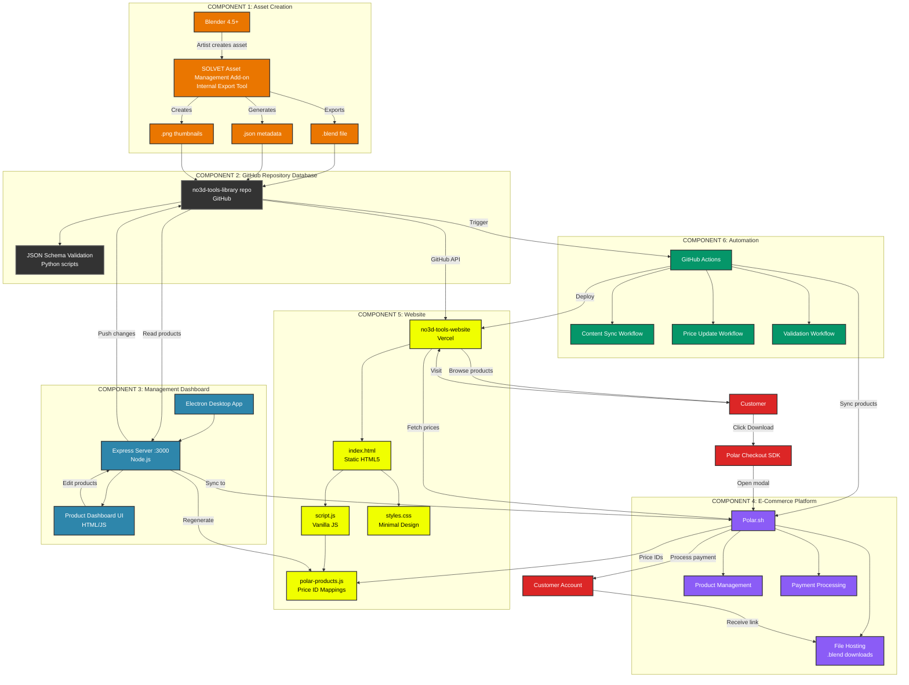

# SOLVET System V1 - Stack Architecture

## Technology Stack Summary:

**Frontend:**
- HTML5 + Vanilla JavaScript
- CSS Grid (minimal black/white + #f0ff00 accent)
- Three.js (3D preview)
- @polar-sh/checkout SDK

**Backend:**
- Node.js v20+
- Express.js
- Electron (dashboard)

**E-Commerce:**
- Polar.sh (@polar-sh/sdk v0.40.3)
- Embedded checkout modal

**Data Storage:**
- GitHub (repository as database)
- JSON metadata files
- Dropbox sync

**Automation:**
- GitHub Actions (CI/CD)
- Python validation scripts
- Node.js sync scripts

**Deployment:**
- Vercel (website hosting)
- GitHub Pages (potential)

## Component Descriptions:

### Component 1: Asset Creation (Orange)
SOLVET Asset Management Add-on (internal use, part of SOLVET workflow) that exports assets with metadata, thumbnails, and .blend files to the repository.

### Component 2: GitHub Repository Database (Dark Gray)
Central source of truth for all product data, using Git for version control and validation.

### Component 3: Management Dashboard (Blue)
Electron desktop app for editing products, syncing prices, and managing the catalog.

### Component 4: E-Commerce Platform (Purple)
Polar.sh handles payments, file hosting, and customer accounts.

### Component 5: Website (Yellow)
Static website deployed on Vercel that displays products and handles checkout.

### Component 6: Automation (Green)
GitHub Actions workflows that sync data between all components automatically.

### Customer Flow (Red)
Shows the customer journey from browsing to purchase to download.
