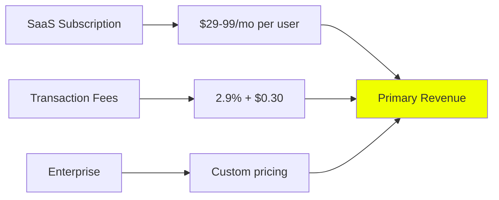
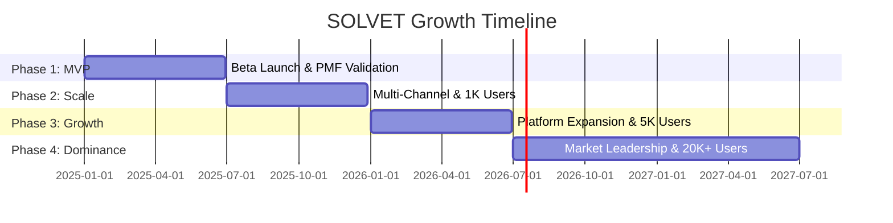
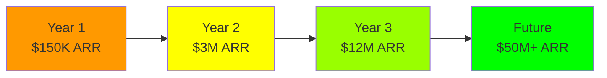
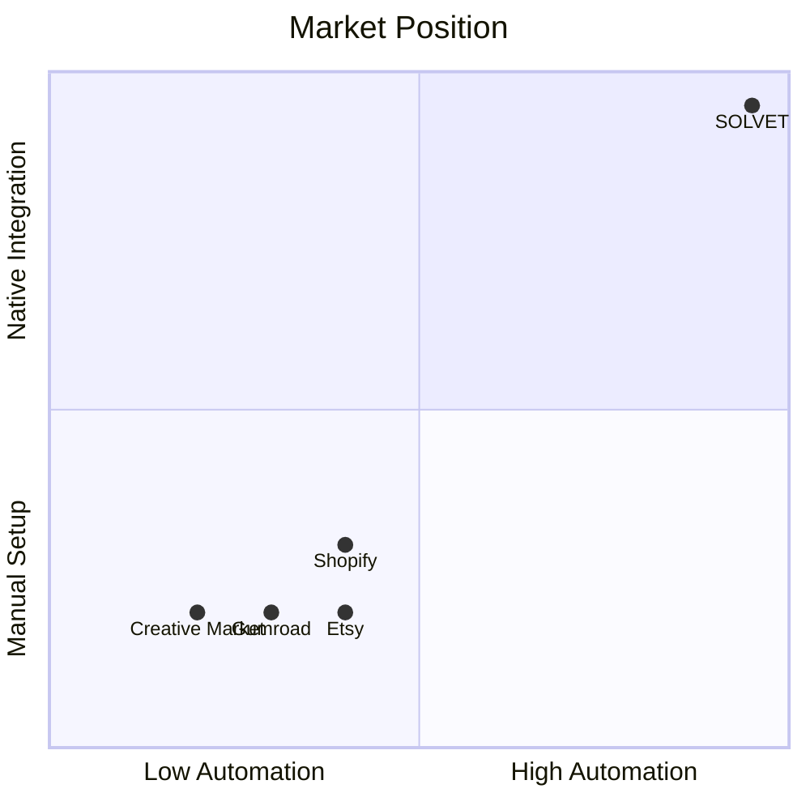

# SOLVET: Investor Roadmap

**Platform:** SOLVET (Streamlined Orchestration for Live Visual Enterprise Transactions)  
**Market:** $104B Creator Economy (15% CAGR) | 50M+ Creators  
**Status:** MVP 90% Complete | Ready for Seed Funding  
**Date:** January 2025

---

## Investment Thesis

SOLVET enables creators to publish digital products directly from creative tools (Blender, Figma, Adobe) to multiple sales channels (Shopify, Etsy, Gumroad) with one-click automation.

**Why Invest:**
- **Massive Market:** $104B creator economy by 2025, 50M+ creators
- **Pain Point:** Creators waste 10-15 hours/week on manual multi-platform publishing
- **Solution:** 90% time reduction with automated pipeline
- **First-Mover:** Only platform with native creative tool integration
- **Unit Economics:** 7-52x LTV/CAC ratio with <2 month payback

---

## Business Model



**Revenue Streams:**
- **Subscription:** $29/mo (Pro) | $99/mo (Business)
- **Transaction Fees:** Optional 2.9% + $0.30
- **Enterprise:** White-label & custom integrations

**Unit Economics:**

| Metric | Year 1 | Year 2 | Year 3 |
|--------|--------|--------|--------|
| **CAC** | $75 | $60 | $45 |
| **LTV** | $540 | $1,320 | $2,340 |
| **LTV/CAC** | **7.2x** | **22x** | **52x** |
| **Payback** | **1.7 mo** | **1.1 mo** | **0.7 mo** |

---

## Growth Trajectory



| Phase | Timeline | Users | MRR | Investment |
|-------|----------|-------|-----|------------|
| **MVP** | Months 1-6 | 100 | $5K | $100K |
| **Scale** | Months 7-12 | 1,000 | $25K | $500K |
| **Growth** | Months 13-18 | 5,000 | $100K | $1M |
| **Dominance** | Months 19-24 | 20,000+ | $500K | $5M |

---

## Financial Projections



**Revenue Growth:**
- **Year 1:** $150K ARR (1,000 users @ $150/year)
- **Year 2:** $3M ARR (20,000 users @ $150/year)
- **Year 3:** $12M ARR (50,000 users @ $240/year)

**Path to $500K MRR in 24 Months:**
```
Month 6:  $5K MRR   (200 users)
Month 12: $25K MRR  (1,000 users)
Month 18: $100K MRR (5,000 users)
Month 24: $500K MRR (20,000 users)
```

---

## Investment Ask

### Seed Round: $100K - $250K

**Use of Funds:**
- **40%** Product development & MVP completion
- **30%** Team expansion (2-3 key hires)
- **20%** Marketing & user acquisition
- **10%** Operations & infrastructure

**Milestones (6 months):**
- ✅ 100 paying beta users
- ✅ $5K MRR
- ✅ Product-market fit validation
- ✅ Multi-channel platform (3+ integrations)

**Projected Returns:**
- **Year 3 Valuation:** $120M - $240M (10-15x ARR multiple)
- **Seed ROI:** 10-24x in 3 years
- **Exit Timeline:** 5-7 years

---

## Competitive Advantage



**Moat:**
1. ✅ **First-mover** in app-native creative tool integration
2. ✅ **Real-time sync** technology (technical complexity)
3. ✅ **Creator-focused** design vs. generic platforms
4. ✅ **Network effects** as creator community grows

---

## Exit Strategy

**Potential Acquirers:**
- **E-commerce:** Shopify, WooCommerce ($50M-$200M)
- **Creative Software:** Adobe, Autodesk, Unity ($100M-$300M)
- **Marketplaces:** Etsy, Creative Market ($200M-$500M)

**Exit Timeline:** 5-7 years  
**Valuation Multiple:** 10-15x ARR (SaaS standard)

---

## Why Now?

**Market Timing:**
- Creator economy exploding ($104B by 2025)
- Digital product sales growing 15% annually
- Platform fragmentation creating massive inefficiency
- No dominant solution exists

**Product Readiness:**
- 90% MVP complete (Blender plugin working)
- Clear technical path to multi-channel
- Founder has creator background + technical expertise
- Proven product-market fit in target segment

**Investment Opportunity:**
- Early stage with massive TAM
- Strong unit economics (7-52x LTV/CAC)
- Clear path to profitability
- First-mover advantage in untapped market

---

**Contact:** [Contact Information]  
**Next Steps:** Seed round open | Due diligence ready

---

*For detailed technical information, see SOLVET_WHITEPAPER.md*  
*For detailed development roadmap, see SOLVET_ROADMAP.md*
