# SOLVET Project Roadmap

**Platform:** SOLVET (Streamlined Orchestration for Live Visual Enterprise Transactions)  
**Version:** 1.0  
**Last Updated:** January 2025

---

## Table of Contents

1. [Overall Project Timeline](#overall-project-timeline)
2. [Phase-by-Phase Roadmap](#phase-by-phase-roadmap)
3. [Component Development Flow](#component-development-flow)
4. [Integration Dependencies](#integration-dependencies)
5. [Technology Stack Evolution](#technology-stack-evolution)
6. [Market Entry Strategy](#market-entry-strategy)

---

## Overall Project Timeline

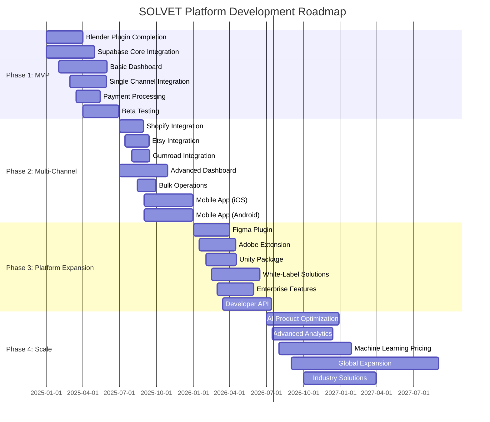

---

## Phase-by-Phase Roadmap

### Phase 1: MVP (Months 1-6)

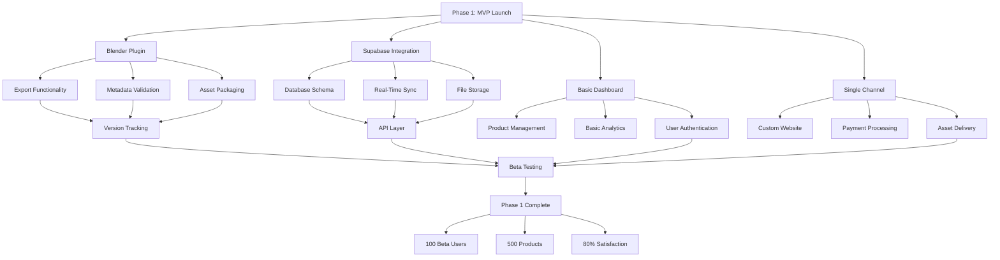

**Key Milestones:**
- ✅ Working Blender plugin (90% complete)
- ✅ Functional Supabase integration
- ✅ Basic management dashboard
- ✅ Single sales channel (custom website)
- ✅ Payment processing (Stripe)
- ✅ Basic analytics

**Success Metrics:**
- 100 beta users
- 500 products managed
- 80% user satisfaction
- <2% error rate

---

### Phase 2: Multi-Channel (Months 7-12)

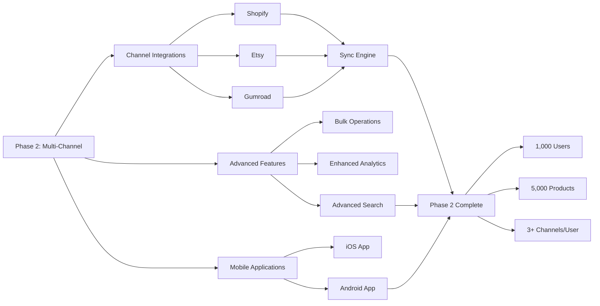

**Key Milestones:**
- Shopify integration
- Etsy integration
- Gumroad integration
- Advanced dashboard features
- Bulk operations
- Enhanced analytics
- Mobile apps (iOS/Android)

**Success Metrics:**
- 1,000 active users
- 5,000 products managed
- 3+ sales channels per user (avg)
- 90% user satisfaction

---

### Phase 3: Platform Expansion (Months 13-18)

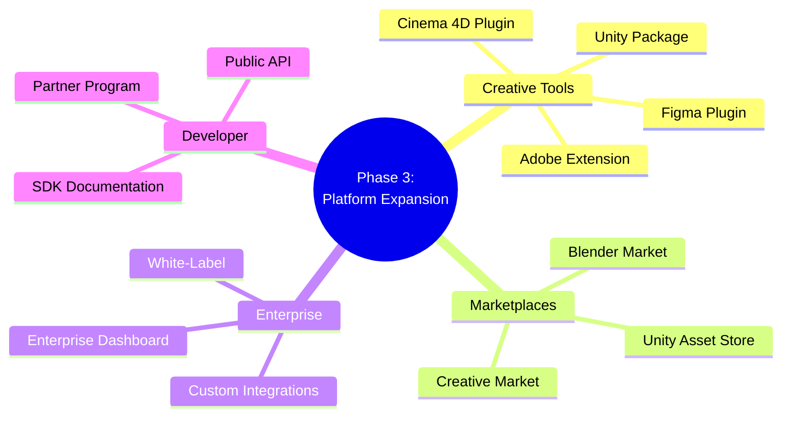

**Key Milestones:**
- Figma plugin
- Adobe Suite extension
- Unity package
- Additional marketplace integrations
- White-label solutions
- Enterprise features
- Developer API

**Success Metrics:**
- 5,000 active users
- 25,000 products managed
- 5+ creative tool integrations
- 10+ sales channel integrations
- $100K+ MRR

---

### Phase 4: Scale (Months 19-24)

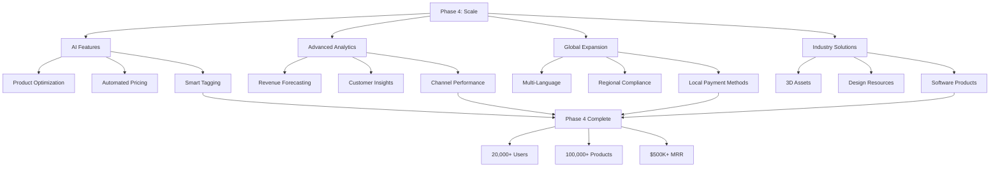

**Key Milestones:**
- AI-powered product optimization
- Advanced analytics and forecasting
- Machine learning for pricing
- Global expansion
- Industry-specific solutions

**Success Metrics:**
- 20,000+ active users
- 100,000+ products managed
- $500K+ MRR
- Market leadership position

---

## Component Development Flow

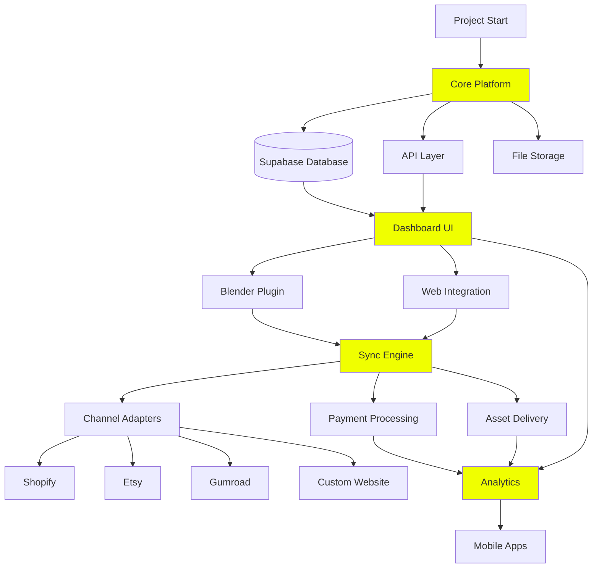

---

## Integration Dependencies

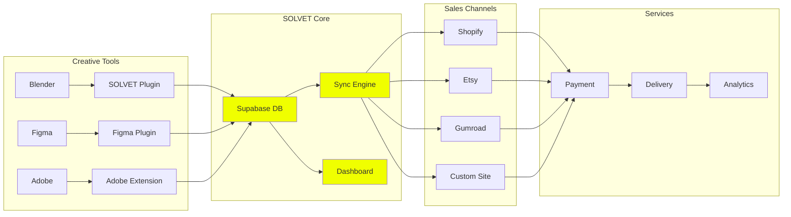

---

## Technology Stack Evolution

```mermaid
timeline
    title Technology Stack Development
    
    section Phase 1: MVP
        Supabase Setup        : Database Schema
                           : Real-Time Subscriptions
                           : File Storage
        React Dashboard      : Basic UI Components
                           : Product Management
                           : Authentication
        Blender Plugin       : Python Add-on
                           : Metadata Export
                           : Asset Packaging
    
    section Phase 2: Multi-Channel
        Channel Adapters     : Shopify API
                           : Etsy API
                           : Gumroad API
        Sync Engine          : Job Queue System
                           : Retry Logic
                           : Conflict Resolution
        Mobile Apps          : React Native
                           : iOS & Android
    
    section Phase 3: Platform Expansion
        Additional Plugins   : Figma Plugin API
                           : Adobe CEP Extension
                           : Unity Package Manager
        Enterprise Features  : White-Label System
                           : Custom Integrations
                           : Advanced Permissions
        Developer API        : REST API
                           : GraphQL API
                           : Webhook System
    
    section Phase 4: Scale
        AI Integration       : Machine Learning Models
                           : Product Optimization
                           : Pricing Intelligence
        Advanced Analytics   : Data Warehouse
                           : Business Intelligence
                           : Predictive Modeling
        Global Infrastructure : Multi-Region Setup
                           : CDN Integration
                           : Compliance Tools
```

---

## Market Entry Strategy

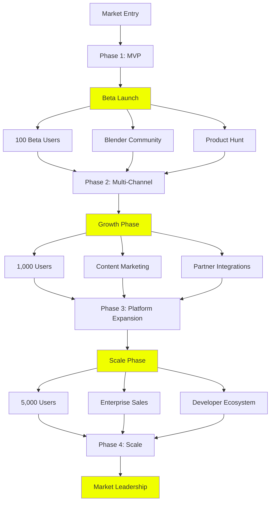

---

## Feature Development Priority

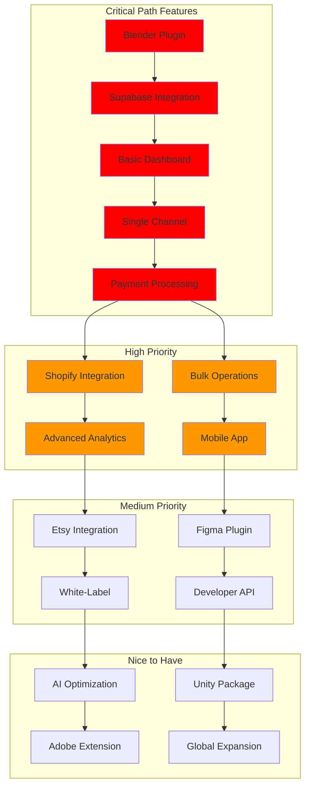

---

## User Journey Map

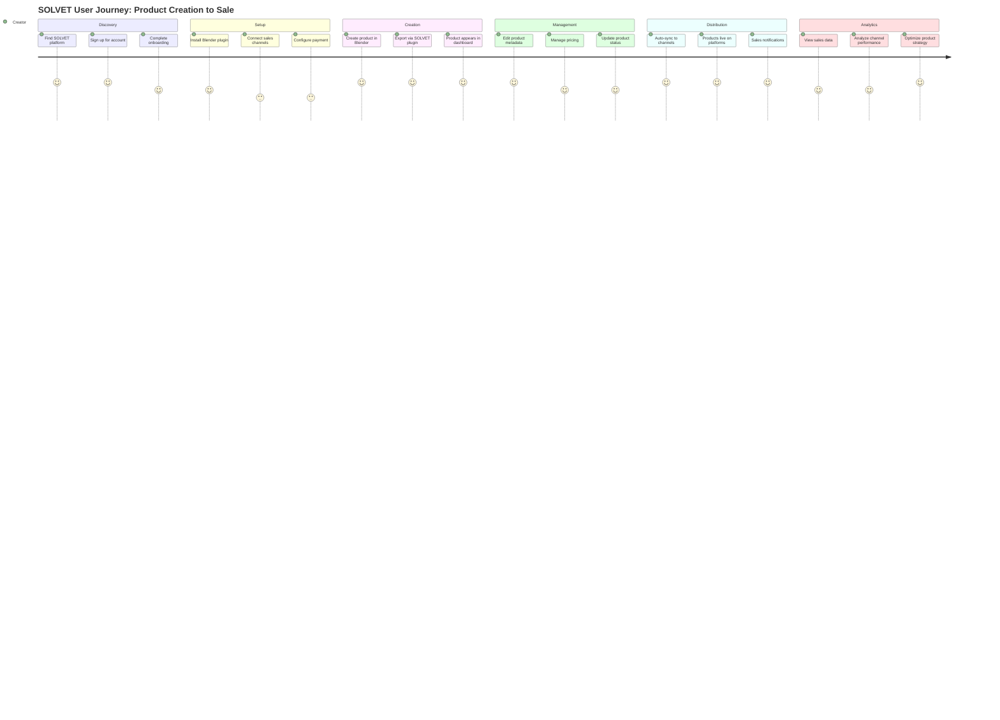

---

## Risk Management

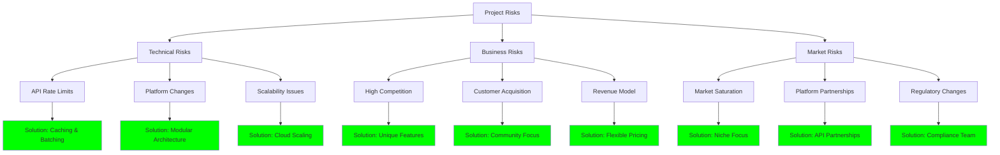

---

## Success Metrics Dashboard

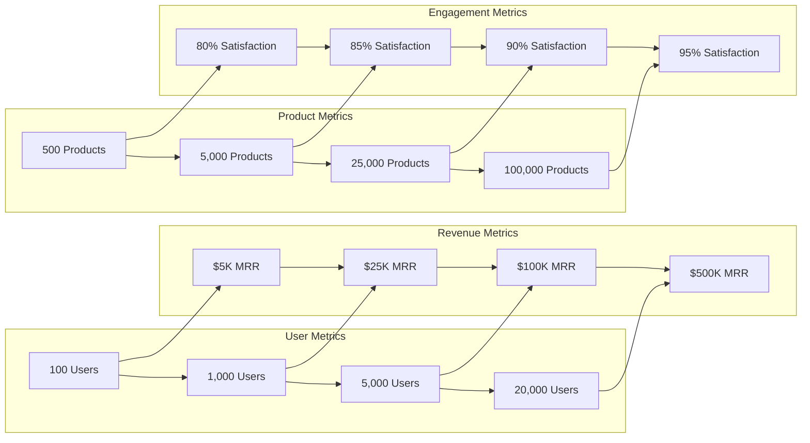

---

## Next Steps

### Immediate Actions (Week 1-4)
1. ✅ Complete Blender plugin final 10%
2. ✅ Set up Supabase project and database schema
3. ✅ Build basic dashboard UI
4. ✅ Implement single channel integration
5. ✅ Set up payment processing

### Short-Term Goals (Month 1-3)
1. Launch beta program with 100 users
2. Gather user feedback and iterate
3. Improve dashboard based on feedback
4. Document API and integration process

### Medium-Term Goals (Month 4-6)
1. Add Shopify integration
2. Implement bulk operations
3. Enhance analytics dashboard
4. Prepare for Phase 2 launch

---

**Document Status:** Active Development  
**Last Updated:** January 2025  
**Next Review:** February 2025

